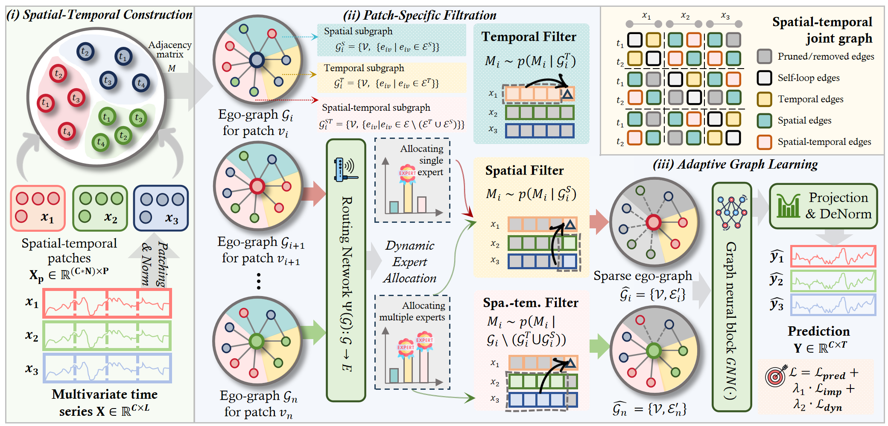

# TimeFilter: Patch-Specific Spatial-Temporal Graph Filtration for Time Series Forecasting

## 🌟 Overview

TimeFilter is a cutting-edge solution for time series forecasting, incorporating three main components: the **Spatial-Temporal Construction** Module, the **Patch-Specific Filtration** Module, and the **Adaptive Graph Learning** Module.



## 🛠 Prerequisites

Ensure you are using Python 3.10.16 and install the necessary dependencies by running:

```
pip install -r requirements.txt
```

## 📊 Prepare Datastes

Begin by downloading the required datasets. All datasets are conveniently available at [iTransformer](https://drive.google.com/file/d/1l51QsKvQPcqILT3DwfjCgx8Dsg2rpjot/view?usp=drive_link). Create a separate folder named `./data` and neatly organize all the csv files as shown below:
```
data
└── electricity.csv
└── ETTh1.csv
└── ETTh2.csv
└── ETTm1.csv
└── ETTm2.csv
└── traffic.csv
└── weather.csv
└── solar_AL.txt
└── PEMS03.npz
└── PEMS04.npz
└── PEMS07.npz
└── PEMS08.npz
```

## 💻 Training

All scripts are located in `./scripts`. For instance, to train a model using the ETTh1 dataset with an input length of 96, simply run:

```shell
bash ./scripts/ETTh1.sh
```

After training:

- Your trained model will be safely stored in `./checkpoints`.
- Numerical results in .npy format can be found in `./results`.
- A comprehensive summary of quantitative metrics is accessible in `./result_long_term_forecast.txt`.
